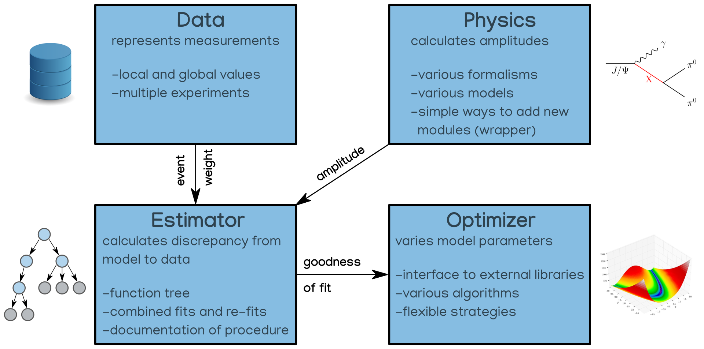

Overview
========

About ComPWA
------------
ComPWA is the flexible and modular "Common Partial Wave Analysis framework" for
various use-cases. ComPWA strives to be perform analyses for various 
high-energy physics experiments to provide a commonly used tool which is stable,
efficient and provides comparable results.

At the moment there are many PWA-tools on the market, most used just for
specific experiments and specific physics cases. But why write the same
software again and again? E.g. the model describing physical processes should
stay the same independent where and how there was a measurement of the process.
Using the actual same implementation of the model does not only save a lot of
time, it also simplifies comparing the results of two experiments. The same
argument holds for optimization-routines and estimation-functions. It might
even allow combined fitting of different experiments instead of taking the
average of the results!

The natural modularization, following the considerations above, would be to
separate into experiment specific information, physics (models, formalisms),
estimation how good the model fits the data and optimization of free
parameters. The first considerations on this where discussed with experts from
different experiments and different technologies where discussed and tested.
The result of this process is the first
`requirement document <https://github.com/ComPWA/ComPWA/wiki/pwa_requirements.pdf>`_
of the new PWA-Framework.

This sketch illustrates the modular concept:

